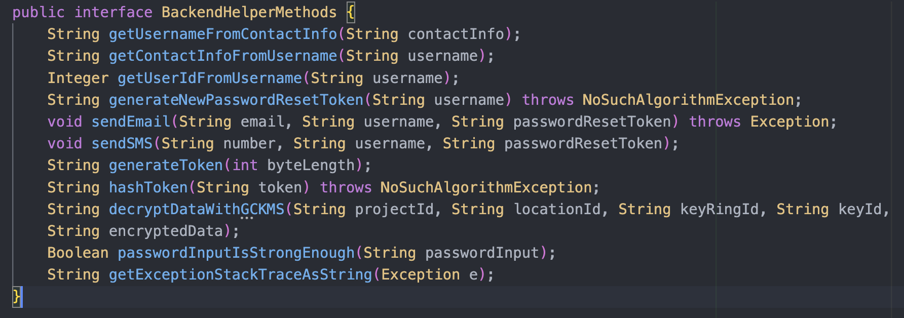
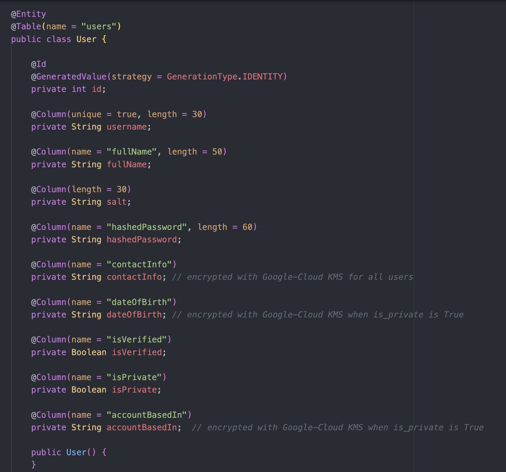
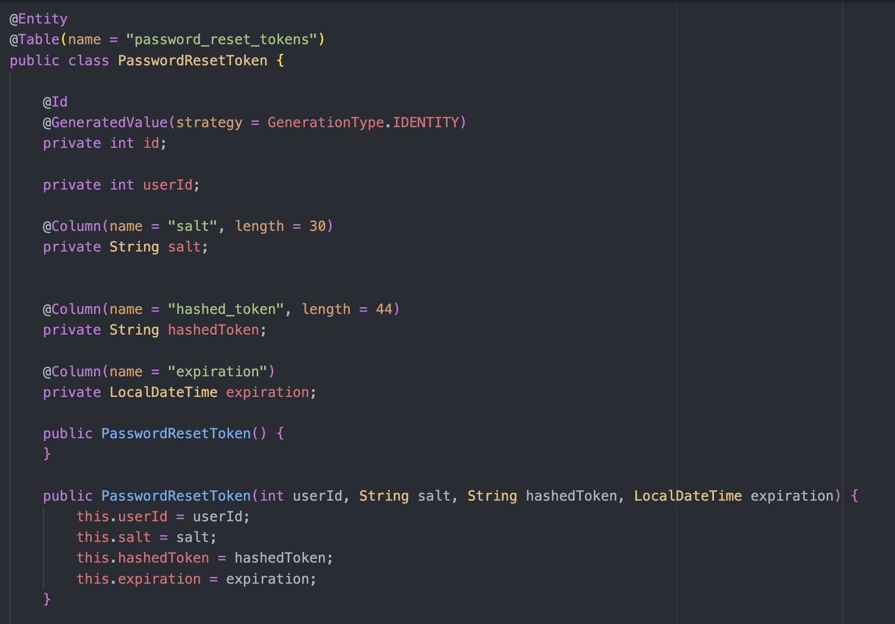

# Reset-Password
  This GitHub repository contains code that powers both the <b>frontend & backend</b> of <b> resetting forgotten passwords</b> of users in <b>Megagram</b>. Megagram is a blend of some of the features of <b>Instagram and Amazon</b>, combined into a single website. It was created by me, <b>Rishav Ray</b>, as a personal project to <b>acquire and then showcase</b> my skills.

  Because a major portion of the project depends on <b>the cloud</b>, in order to <b>save costs</b> on that, I <b>only activate</b> my frontend, backend and data/cloud-services for about 1-2 days max upon request, assuming that there aren't too many cloud-services also running at the time(<b>my contact-info is presented in the bottom-section</b>). <b>Once they're activated</b>, you should know that the frontend-urls begin with https://megagram.com/reset-password/, and the backend-urls with https://megagram.com/reset-password/api/.

  If you so choose, you can use the <b>username 'testuser'</b> and the <b>password 'IamTESTINGMegagram1!!'</b> to login to Megagram as an actual user(although, unlike actual users, <b>you won't be able to edit the username or password</b> of this account).

  Welcome aboard!


## Table of Contents
  0. [Project Disclaimers](#project-disclaimers)
  1. [Key Points on Frontend](#key-points-on-frontend)
  2. [Key Points on Backend](#key-points-on-backend)
  3. [Key Points on Data](#key-points-on-data)
  4. [Key Points on Cloud](#key-points-on-cloud)
  5. [Running the Frontend and Backend](#running-the-frontend-and-backend)
  6. [Video of Frontend](#video-of-frontend)
  7. [Video of Backend](#video-of-frontend)
  8. [Finale(My Contact Info is Here)](#finale)


## Project Disclaimers
  Because this project wasn't done as part of a job/business, focusing on every single detail is <b>unnecessary</b>. Here is a list of some of the <b>main things</b> in this project that have been done in this project for the <b>sake of convenience and simplicity rather than for actual effectiveness</b>.

  * The <b>'users'</b> MySQL table is hosted on my <b>local Macbook instead of the cloud</b>. The same goes for the <b>'password_reset_tokens'</b> PostgresSQL table. Both of these are accessible <b>via Ngrok</b>. 

  * The backend <b>doesn't have rate-limiting</b> enabled for any of the endpoints.

  * In order to <b>save money on the cloud</b>, the website will <b>only be run on demand</b>. Furthermore, although auto-scaling is enabled in the Heroku deployments of both the frontend and backend, the <b>max web-dynos number is set to 1</b>(which obviously defeats the purpose of autoscaling for software in the real world).


## Key Points on Frontend
  * The frontend is powered by <b>ReactJS</b> and is located in the <b>reactjs-frontend1</b> directory of this Github repo.

  * Inside reactjs-frontend1 will be <b>src</b>, which contains the <b>following key folders</b>: assets, components, and views. It also contains the <b>following key files</b>: index.js, routing.jsx, and styles.css.

  * There are <b>2 endpoints</b>: /forgotPassword and /setNewPassword/{username}/{passwordResetToken}. Both endpoints start with https://megagram.com/reset-password/. 

  * Each of the frontend pages work for both <b>dark-mode and light-mode of the system</b>, and have been <b>successfully tested</b> across the <b>top 5 most popular browsers</b> and across the <b>numerous different screen-sizes</b> provided by Google-Chrome Dev-Tools.

  * When the user visits the <b>/forgotPassword page</b>, they have the option to submit their <b>username/phone-number/email-address</b> so that they can get <b>sent a link</b>(to the phone-number/email-address associated with their account) that gives them the option to set a new password. The link that gets sent to them will <b>take the user to the /setNewPassword page</b>, elaborated in the next point.

  * The <b>/setNewPassword page</b> takes two URL-parameters: username and password-reset-token. The password-reset-token is a token that allows a user to <b>reset their password within 30-minutes</b> of when the token was issued to them. In the page, a user must <b>enter a new password that is strong enough</b> and then confirm the password before submitting it to the server. If everything is <b>successful, the user will be redirected</b> to the https://megagram.com/login-register/login.

  * You can append <b>?language=Italiano or ?language=日本語</b> to the URL to trigger backend calls for <b>translations via a language-translation API</b>. For translations that are already cached in Redis, the backend(not springBootBackend1; instead it is in the Login-Register repo under the login_register_backend directory) directly returns that instead of spending money and API-usage-tokens on the RapidAPI DeepTranslate API Service. 

  * Whenever the user tries to access an endpoint in the frontend that <b>does not exist</b>, they will come across a <b>'Page-Not-Found'</b> page that is very well styled. It was created by an <b>impeccable Graphics designer</b> and the styling is <b>very exquisite and complex</b>, but I was able to <b>alter</b> the HTML/JS/CSS just a bit so that it <b>fits the 'Megagram' brand</b>.


## Key Points on Backend
  * The backend is powered by <b>Java Spring Boot</b> and is located in the <b>springBootBackend1</b> directory in this Github repo. It supports the methods <b>'POST' & 'PATCH'</b>.

  * There are <b>2 endpoints</b>, listed below. All the endpoints start with https://megagram.com/reset-password/api/. 
      1. /sendLinkForSettingNewPassword

      2. /resetPassword/{username}/{passwordResetToken}

  * For the MySQL 'users' table, the backend uses a <b>model(User) and repository(UserRepository)</b>. For accessing the <b>'Usernames and their Info'</b> Redis hashset, it uses a Redis-client initialized in the start of the BackendController.java file with the help of <b>environment-variables and Jedis</b>. For the PostgresSQL 'password_reset_tokens' table, the backend uses a <b>model(PasswordResetToken) and repository(PasswordResetTokenRepository)</b>.

  * There are <b>11 helper methods</b> in the backend that are not directly accessible via the Rest API but are used by the methods that are accessible via the Rest API. For the sake of organization of BackendController.java, <b>first all the Rest API methods are listed</b> and <b>then all the helper-methods</b>. Below is a screenshot of the <b>names and parameters of all 11 helper-methods</b>.
  

## Key Points on Data
  * For this repository, there's one locally-hosted MySQL table called <b>'users'</b>; one locally-hosted PostgresSQL table called <b>'password_reset_tokens'</b>; finally, there's one <b>AWS-Redis caching-system that serves two purposes</b> in this website(more on that later). 

  * You can connect to the <b>Locally-hosted MySQL Database with read-only-access</b> via the following details: host: 'ngrok(update this later)', username: 'spectator', password: ''(no password). You can also connect to the <b>Locally-hosted PostgresSQL Database with read-only-access</b> via the following details: host: 'ngrok(update this later)', username: 'spectator', password: 'mt'. You can also connect to the <b>AWS-Redis Cache with read-only-access</b> using host: 'redis-14251.c261.us-east-1-4.ec2.redns.redis-cloud.com:14251', username: 'spectator', & password: 'SPECtator1!!'.

  * The <b>'users' table</b> has fields that can be described in the screenshot below. Users must be <b>at-least 10 years of age</b> and the accountBasedIn field must be either <b>a US-State, a country, or 'N/A'/'Temporary'</b>. The password must pass a <b>strength test</b> and is only stored in the database after salting and hashing it(i.e user passwords are <b>not stored as plaintext</b>). 
  
  
  * The <b>'password_reset_tokens' table</b> has fields that can be described in the screenshot below. These are tokens that enable a user to <b>reset their password before the token expires</b>. Each token expires in 30 minutes from when it was issued. For the sake of security, the tokens are treated as passwords and <b>aren't stored in plaintext</b>; instead they are <b>salted and hashed</b> before storing them in the table.
  

  * The <b>two purposes of AWS-Redis for Reset-Password are as follows</b>: (1) For using hash-sets named something like <b>'Translations from English to Español'</b> which stores key-value pairs
  where keys are English words and values are their Spanish translations. This is used by the frontend for translating the website; this hash-set <b>aids in efficiency and reducing money/usage-tokens spent</b> when making requests to the Rapid-API Deep-Translate API service. (2) For using the hash-set <b>'Usernames and their Info'</b> which contains keys that are usernames of Megagram-users and values that are stringified dicts that contain their info(i.e all the other fields of the user in the 'users' table). This hash-set enables <b>efficiency in fetching user-info</b>.


## Key Points on Cloud
  * For the <b>Reset-Password</b> section of Megagram, the two cloud-service-providers used are <b>Heroku and GCP(Google Cloud Platform)</b>.

  * GCP is used in the helper method called <b>decryptDataWithGCKMS()</b>, which is called in BackendController.java whenever the <b>contact-info of a user needs to be decrypted</b> via the Google-Cloud Key-Management-Service key used to <b>encrypt it in the first place</b>. 

  * <b>Heroku</b> is used for the <b>deployment</b> of both the frontend and backend production servers. 

  * GCP is used for the <b>Managed Instance Group(MIG) called 'megagram-server-group'</b>. This MIG has <b>auto-scaling enabled</b> and each instance in this group has a <b>startup-script(located in this repo as megagram-server-startup.sh)</b> that uses nginx to handle traffic at port 443. The nginx proxy-passes requests with <b>/reset-password/ and /reset-password/api/</b> to https://reactjs-frontend-1/herokuapp.com/ and https://spring-boot-backend-1/herokuapp.com/ respectively. This MIG has a load-balancer that maps to port 443 of each instance in the MIG, and the ip-address of this load-balancer is the one that is <b>directly associated</b> with https://megagram.com!


## Running the Frontend and Backend
  <b>Because Code Reproducibility is Very Important!</b>

  If you would like to run a <b>development-server/production-server of the frontend</b> on your own computer/VM/container/etc, follow these steps:

  `0.` Run the following terminal-command:
  ```bash 
  git clone https://github.com/MegaGramProject/Reset-Password.git
  ```

  `1.` Run the following terminal-command:
  ```bash 
  cd Reset-Password/reactjs-frontend1
  ```

  `2.` Run the following terminal-command:
  ```bash
  sudo npm install
  ```

  `3.` Run the following terminal-command(<b>in package.json, free to replace PORT=8002</b> with another available port) for the <b>Development Server</b>:
  ```bash 
  sudo npm run start
  ```
  For the <b>Production Server</b>, use these two commands <b>instead</b>(feel <b>free to replace 8002 with another available port</b>):
  ```bash 
  npm run build
  npx serve -s build -l 8002
  ```

  --------

  If you would like to run a <b>development-server/production-server of the backend</b> on your own machine/VM/container/etc, follow these steps:

  `0.`  <b>Ensure that you have the environment-variables set</b> for GOOGLE_APPLICATION_CREDENTIALS(to the path of your Google-Cloud-Services-Credentials-JSON-file), EMAIL_SENDER_AUTH_TOKEN, TWILIO_ACCOUNT_SID, TWILIO_AUTH_TOKEN, TWILIO_PHONE_NUMBER, AWS_REDIS_PASSWORD, LOCAL_MYSQL_URL_VIA_NGROK, LOCAL_MYSQL_USER,
  LOCAL_MYSQL_PASSWORD, LOCAL_PSQL_URL_VIA_NGROK, LOCAL_PSQL_USER, LOCAL_PSQL_PASSWORD, & LOCAL_MONGODB_URI_VIA_NGROK.

  `1.` Run the following terminal-command:
  ```bash 
  git clone https://github.com/MegaGramProject/Reset-Password.git
  ```

  `2.` Run the following terminal-command:
  ```bash 
  cd Reset-Password/springBootBackend1
  ```

  `3.` Run the following terminal-command(in src/main/resources/application.properties, feel <b>free to replace 8003 with another available port</b>) for the <b>Development Server</b>:
  ```bash 
  ./mvnw spring-boot:run
  ```

  For the <b>Production Server</b>, use these two commands <b>instead</b>(in /src/main/resources/application.properties, feel free to <b>replace 8003 with another available port</b>)-
  ```bash 
  ./mvnw clean install
  java -jar target/springBootBackend1-0.0.1-SNAPSHOT.jar
  ```
  --------

  If you prefer to use <b>Heroku instead</b>, here are the steps for that.

  `0.` Run the following terminal-command:
  ```bash 
  git clone https://github.com/MegaGramProject/Reset-Password.git
  ```

  `1.` Run the following terminal-command:
  ```bash 
  cd Reset-Password
  ```

  `2.` For the <b>frontend production-server</b>:
  Add a file inside reactjs-frontend1 named 'Procfile'. It should contain the following line:
  ```  
  web: npx serve -s build -l 8002 # feel free to replace 8002 with any available port
  ```

  <b>OR</b>, for the <b>backend production-server</b>:
  Add a file inside springBootBackend1 named 'Procfile'. It should contain the following line:
  ```  
  web: java -jar target/springBootBackend1-0.0.1-SNAPSHOT.jar
  ```

  `3.` Run the following terminal-command for the <b>frontend production-server</b>:
  ```bash 
  heroku create reactjs-frontend-1 --remote heroku-rjf1 #replace 'reactjs-frontend-1' with a heroku app name that isn't already taken. Feel free to replace 'heroku-rjf1' with a non-taken remote repository alias of your choice.
  ```

  <b>OR</b> if you would like to use the <b>backend production-server</b>:
  ```bash 
  heroku create spring-boot-backend-1 --remote heroku-sbb1 #replace 'spring-boot-backend-1' with a heroku app name that isn't already taken. Feel free to replace 'heroku-sbb1' with a non-taken remote repository alias of your choice.
  ```

  `4.` Run the following terminal-command for the <b>frontend production-server</b>:
  ```bash 
  heroku ps:autoscale web --min=1 --max=5 --app reactjs-frontend-1 #replace 'reactjs-frontend-1' with the name of the heroku app you created. Feel free to adjust the min and max to your liking.
  ```

  <b>OR</b> if you would like to use the <b>backend production-server</b>:
  ```bash 
  heroku ps:autoscale web --min=1 --max=5 --app spring-boot-backend-1 #replace 'spring-boot-backend-1' with the name of the heroku app you created. Feel free to adjust the min and max to your liking.
  ```

  `5.` Run the following terminal-command for the <b>frontend production-server</b>:
  ```bash 
  git push heroku-rjf1 main --directory=reactjs-frontend1 # replace 'heroku-rjf1' with the remote repository alias you chose for your Heroku app
  ```

  <b>OR</b> if you would like to use the <b>backend production-server</b>:
  ```bash 
  heroku config:set \
    TWILIO_ACCOUNT_SID='INSERT HERE' \
    TWILIO_AUTH_TOKEN='INSERT HERE' \
    TWILIO_PHONE_NUMBER='INSERT HERE' \
    EMAIL_SENDER_AUTH_TOKEN='INSERT HERE' \
    AWS_REDIS_PASSWORD='INSERT HERE' \
    GOOGLE_APPLICATION_CREDENTIALS='INSERT HERE' \
    LOCAL_MONGODB_URI_VIA_NGROK='INSERT HERE' \
    LOCAL_MYSQL_USER='INSERT HERE' \
    LOCAL_MYSQL_PASSWORD='INSERT HERE' \
    LOCAL_PSQL_USER='INSERT HERE' \
    LOCAL_PSQL_PASSWORD='INSERT HERE' \
    LOCAL_MYSQL_URL_VIA_NGROK='INSERT HERE' \
    LOCAL_PSQL_URL_VIA_NGROK='INSERT HERE' \
    --app spring-boot-backend-1-heroku # replace 'spring-boot-backend-1-heroku' with the name of your Heroku app
  ```
  <b>Note</b>: for GOOGLE_APPLICATIONS_CREDENTIALS, you must include the path of your <b>Google-Cloud-Services-Account JSON file</b> relative to springBootBackend1. This file <b>must be present somewhere in springBootBackend1</b>, 
  but be sure to <b>add it to .gitignore</b> if you ever plan to push changes to a regular Github remote repository. If you are about to push changes to your heroku app remote repo, however, <b>be sure to remove the file from the .gitignore</b> so that it can get pushed to Heroku successfully.

  `6.` If you would like to use the <b>backend production-server</b>, run the terminal-command below:
  ```bash 
  git push heroku-sbb1 main --directory=springBootBackend1 # replace 'heroku-sbb1' with the remote repository alias you chose for your Heroku app
  ```

  `7.` Run the following terminal-command:
  ```bash 
  heroku open
  ```
  This will redirect you to your browser at https://\<your-heroku-app-name\>.herokuapp.com/, from which you can 
  <b>make requests to the production-server you wanted to use</b>!


## Video of Frontend
  <video src="./README_imgs_&_vids/videoOfFrontend.mp4" controls></video>


## Video of Backend
  <video src="./README_imgs_&_vids/videoOfBackend.mp4" controls></video>


## Finale
  Thank you for sticking around till the end! Hope you found what you were looking for. Whether you did or did not, feel free to reach out to me using any of the following methods:

  * Email: rishavray422@gmail.com

  * Number(texting only): <span style="color:#03b6fc">608-443-7805</span>

  * Linkedin: https://www.fakelink.com