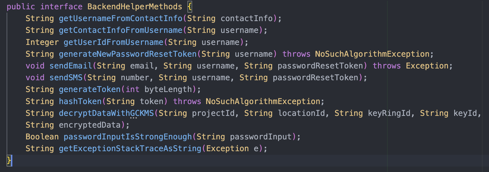
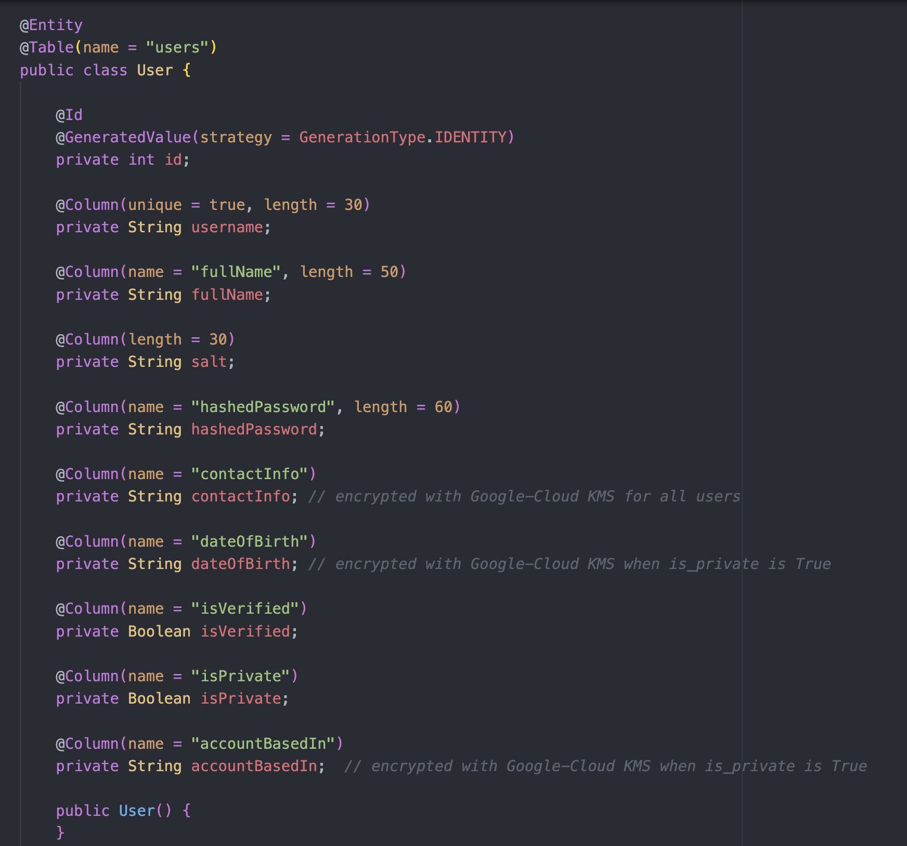
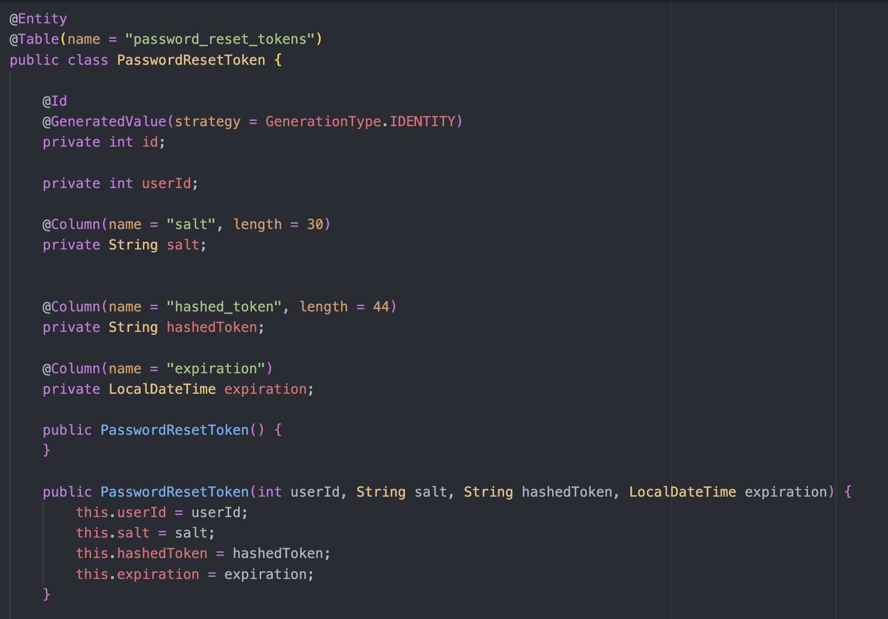

# Reset-Password
  This GitHub repository contains code that powers both the <b>frontend & backend</b> of <b>resetting forgotten passwords</b> of people that use <b>Megagram</b>. Megagram is a blend of some of the features of <b>Instagram and Amazon</b>, combined into a single website. It was created by me, <b>Rishav Ray</b>, as a personal project to <b>acquire and then showcase</b> my skills. To <b>allocate my time efficiently</b>, I focused on <b>three of the nine key repositories</b> of Megagram —<b>Login-Register, Reset-Password, and Home-Page</b>— which when combined <b>fulfills</b> my <b>purpose</b> of the <b>entire endeavor</b>. I also focused on the <a href="https://github.com/rishavry/WorksPresentation" style="font-weight: bold;" target="_blank" rel="noopener noreferrer">WorksPresentation Github repository</a> of mine(which has a <b>wiki with important info</b>), containing a complex frontend that acts as a <b>website about me for job-recruiters and employers to view</b>!

  <b>Welcome</b> aboard!

## Table of Contents
  0. [Important Disclaimer](#important-disclaimer-because-honesty-is-the-best-policy)
  1. [Key Points on Frontend](#key-points-on-frontend)
  2. [Key Points on Backend](#key-points-on-backend)
  3. [Key Points on Data](#key-points-on-data)
  4. [Key Points on Cloud](#key-points-on-cloud)
  5. [Video-Demonstration of Frontend](#video-demonstration-of-frontend)
  6. [Finale(My Contact Info is Here)](#finale)

## Important Disclaimer because Honesty is the Best Policy

During the first iteration of Project Megagram, I worked on all nine repositories. In the second iteration, I narrowed my focus to three of them, including this Reset-Password repository. In the third and final iteration, I continued concentrating on these three repositories. However, I chose not to fully revise and polish all the frontend and backend files across them, as the work(which I was not paid at all for) felt repetitive and offered limited new learning and 'showing-skills-to-future-employer' opportunities. Furthermore, all the cloud-services that my project so heavily relies on were out of my budget.

To combat the issues above, I used the final iteration to create detailed wiki pages in my <a href="https://github.com/rishavry/WorksPresentation" style="font-weight: bold;" target="_blank" rel="noopener noreferrer">WorksPresentation Github repository</a>. These documents outline how I would approach various aspects of frontend, backend, cloud architecture, and more, if I were tasked with building them under real-world conditions.

As a result, the current state of the content in this repository(including the rest of the README below) may not fully reflect industry-grade optimization or deployment readiness. Rather, it represents earlier work, with my more refined thought process and technical strategies documented in the associated wiki pages.

## Key Points on Frontend
  * The frontend is powered by <b>ReactJS</b> and is located in the <b>reactjs-frontend1</b> directory of this Github repo.

  * Inside reactjs-frontend1 will be <b>src</b>, which contains the <b>following key folders</b>: assets, components, and views. It also contains the <b>following key files</b>: index.js, routing.jsx, and styles.css.

  * There are <b>2 endpoints</b>: /forgotPassword and /setNewPassword/{username}/{passwordResetToken}. Both endpoints start with https://project-megagram.com/reset-password/. 

  * Each of the frontend pages work for both <b>dark-mode and light-mode of the system</b>, and have been <b>successfully tested</b> across the <b>top 5 most popular browsers</b> and across the <b>numerous different screen-sizes</b> provided by Google-Chrome Dev-Tools.

  * When the user visits the <b>/forgotPassword page</b>, they have the option to submit their <b>username/phone-number/email-address</b> so that they can get <b>sent a link</b>(to the phone-number/email-address associated with their account) that gives them the option to set a new password. The link that gets sent to them will <b>take the user to the /setNewPassword page</b>, elaborated in the next point.

  * The <b>/setNewPassword page</b> takes two URL-parameters: username and password-reset-token. The password-reset-token is a token that allows a user to <b>reset their password within 30-minutes</b> of when the token was issued to them. In the page, a user must <b>enter a new password that is strong enough</b> and then confirm the password before submitting it to the server. If everything is <b>successful, the user will be redirected</b> to the https://project-megagram.com/login-register/login.

  * You can append <b>?language=Italiano or ?language=日本語</b> to the URL to trigger backend calls for <b>translations via a language-translation API</b>. For translations that are already cached in Redis, the backend(not springBootBackend1; instead it is in the Login-Register repo under the login_register_backend directory) directly returns that instead of spending money and API-usage-tokens on the RapidAPI DeepTranslate API Service. 

  * Whenever the user tries to access an endpoint in the frontend that <b>does not exist</b>, they will come across a <b>'Page-Not-Found'</b> page that is very well styled. It was created by an <b>impeccable Graphics designer</b> and the styling is <b>very exquisite and complex</b>, but I was able to <b>alter</b> the HTML/JS/CSS just a bit so that it <b>fits the 'Megagram' brand</b>.

## Key Points on Backend
  * The backend is powered by <b>Java Spring Boot</b> and is located in the <b>springBootBackend1</b> directory in this Github repo. It supports the methods <b>'POST' & 'PATCH'</b>.

  * There are <b>2 endpoints</b>, listed below. All the endpoints start with https://project-megagram.com/reset-password/api/. 
      1. /sendLinkForSettingNewPassword

      2. /resetPassword/{username}/{passwordResetToken}

  * For the MySQL 'users' table, the backend uses a <b>model(User) and repository(UserRepository)</b>. For accessing the <b>'Usernames and their Info'</b> Redis hashset, it uses a Redis-client initialized in the start of the BackendController.java file with the help of <b>environment-variables and Jedis</b>. For the PostgresSQL 'password_reset_tokens' table, the backend uses a <b>model(PasswordResetToken) and repository(PasswordResetTokenRepository)</b>.

  * There are <b>11 helper methods</b> in the backend that are not directly accessible via the Rest API but are used by the methods that are accessible via the Rest API. For the sake of organization of BackendController.java, <b>first all the Rest API methods are listed</b> and <b>then all the helper-methods</b>. Below is a screenshot of the <b>names and parameters of all 11 helper-methods</b>.
  

## Key Points on Data
  * For this repository, there's one locally-hosted MySQL table called <b>'users'</b>; one locally-hosted PostgresSQL table called <b>'password_reset_tokens'</b>; finally, there's one <b>AWS-Redis caching-system that serves two purposes</b> in this website(more on that later). 

  * You can connect to the <b>Locally-hosted MySQL Database with read-only-access</b> via the following details: host: 'ngrok(update this later)', username: 'spectator', password: ''(no password). You can also connect to the <b>Locally-hosted PostgresSQL Database with read-only-access</b> via the following details: host: 'ngrok(update this later)', username: 'spectator', password: 'mt'. You can also connect to the <b>AWS-Redis Cache with read-only-access</b> using host: 'redis-14251.c261.us-east-1-4.ec2.redns.redis-cloud.com:14251', username: 'spectator', & password: 'SPECtator1!!'.

  * The <b>'users' table</b> has fields that can be described in the screenshot below. Users must be <b>at-least 10 years of age</b> and the accountBasedIn field must be either <b>a US-State, a country, or 'N/A'/'Temporary'</b>. The password must pass a <b>strength test</b> and is only stored in the database after salting and hashing it(i.e user passwords are <b>not stored as plaintext</b>). 
  
  
  * The <b>'password_reset_tokens' table</b> has fields that can be described in the screenshot below. These are tokens that enable a user to <b>reset their password before the token expires</b>. Each token expires in 30 minutes from when it was issued. For the sake of security, the tokens are treated as passwords and <b>aren't stored in plaintext</b>; instead they are <b>salted and hashed</b> before storing them in the table.
  

  * The <b>two purposes of AWS-Redis for Reset-Password are as follows</b>: (1) For using hash-sets named something like <b>'Translations from English to Español'</b> which stores key-value pairs
  where keys are English words and values are their Spanish translations. This is used by the frontend for translating the website; this hash-set <b>aids in efficiency and reducing money/usage-tokens spent</b> when making requests to the Rapid-API Deep-Translate API service. (2) For using the hash-set <b>'Usernames and their Info'</b> which contains keys that are usernames of Megagram-users and values that are stringified dicts that contain their info(i.e all the other fields of the user in the 'users' table). This hash-set enables <b>efficiency in fetching user-info</b>.

## Key Points on Cloud
  * For the <b>Reset-Password</b> section of Megagram, the two cloud-service-providers used are <b>Heroku and GCP(Google Cloud Platform)</b>.

  * GCP is used in the helper method called <b>decryptDataWithGCKMS()</b>, which is called in BackendController.java whenever the <b>contact-info of a user needs to be decrypted</b> via the Google-Cloud Key-Management-Service key used to <b>encrypt it in the first place</b>. 

  * <b>Heroku</b> is used for the <b>deployment</b> of both the frontend and backend production servers. 

  * GCP is used for the <b>Managed Instance Group(MIG) called 'megagram-server-group'</b>. This MIG has <b>auto-scaling enabled</b> and each instance in this group has a <b>startup-script(located in this repo as megagram-server-startup.sh)</b> that uses nginx to handle traffic at port 443. The nginx proxy-passes requests with <b>/reset-password/ and /reset-password/api/</b> to https://reactjs-frontend-1/herokuapp.com/ and https://spring-boot-backend-1/herokuapp.com/ respectively. This MIG has a load-balancer that maps to port 443 of each instance in the MIG, and the ip-address of this load-balancer is the one that is <b>directly associated</b> with https://project-megagram.com!

## Video-Demonstration of Frontend
  Right <a href="https://the-works-of-rishav-ray.com/videos/ResetPasswordFrontendDemonstration.mov" target="_blank" rel="noopener noreferrer">here</a>.

## Finale
  Thank you for sticking around till the end! Hope you found what you were looking for. Whether you did or did not, feel free to reach out to me using any of the following methods:

  * Email: rishavray422@gmail.com

  * Number(texting only): 608-443-7805

  * Linkedin: https://www.fakelink.com